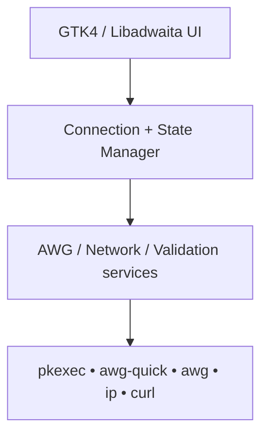

# AmneziaWG-Nexus

**A modern, secure and elegant AmneziaWG VPN manager for Linux.**

   

## Features
- Native dark-first GTK4/Libadwaita dashboard with adaptive cards, search, selection, refresh, and profile-folder action.
- Discovers `/etc/amnezia/*.conf`, validates required fields, serialises profile switching, and never renders configuration secrets.
- Asynchronous tunnel details, endpoint, handshake, transfer totals, and public IPv4 refresh.
- PolicyKit is used only for `awg-quick up/down`; the graphical application never runs as root.
- Fixed subprocess argument vectors, no shell execution, and profile path traversal protection.

## Architecture


## Requirements
Arch or Garuda Linux, Python 3.10+, GTK4, PyGObject, Libadwaita, `curl`, and AmneziaWG tools `awg` and `awg-quick`.

## Quick Start
```bash
git clone https://github.com/mrf3ri/AmneziaWG-Nexus.git
cd AmneziaWG-Nexus
chmod +x install.sh uninstall.sh
./install.sh
amneziawg-nexus
```

## Client Configuration
```bash
sudo mkdir -p /etc/amnezia
sudo cp ~/Downloads/your-profile.conf /etc/amnezia/
sudo chmod 600 /etc/amnezia/your-profile.conf
amneziawg-nexus
```
Nexus reads configuration but does not edit it. See [client setup](docs/CLIENT_SETUP.md) and [Ubuntu server setup](docs/SERVER_SETUP.md).

## Screenshots
The dashboard is implemented; screenshots are intentionally not fabricated. Add desktop captures to `docs/screenshots/` when available.

## Security
All subprocess calls use explicit argv values with `shell=False`. Profiles must be `.conf` files immediately below `/etc/amnezia`. Private keys, pre-shared keys, and raw configuration contents are neither shown nor logged.

## Testing
```bash
python -m pytest
python -m compileall app tests
```

## Project Structure
`app/` houses application, security, services and GTK UI; `assets/` contains theme and icon; `data/` contains launcher; `tests/` holds no-live-VPN unit tests; `docs/` holds setup guides.

## Roadmap
- [x] Multi-profile support, connect/disconnect/switching, status, traffic totals, public IP, validation
- [ ] QR import, export, system tray, kill switch, auto-connect, connection history

## License
GPL-3.0-or-later. See [LICENSE](LICENSE).
